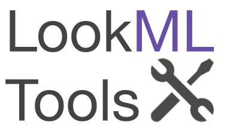

# LookML Tools

This repository contains some tools to handle best practices of a set of developers working on LookML files.

There are three tools: 

 - `LookML updater`
 - `LookML linter`
 - `LookML grapher`

Sites:
 - source: https://github.com/ww-tech/lookml-tools
 - documentation: https://ww-tech.github.io/lookml-tools/
 - Pypi: https://pypi.org/project/lookml-tools/

## LookML updater
The first tool helps solve a problem of official definitions of `dimensions` and `measures`&mdash;such as in a business glossary&mdash;getting out of sync from some other system. The solution implemented here is to have a remote master list whose definitions are propagated to LookML. Thus, given some remote definition for a given LookML `dimension`, `dimension_group`, or `measure`, inject it in the LookML.

Full documentation is [here](README_UPDATER.md).


## LookML linter
The second tool helps us check that our LookML conforms to some given coding standards and LookML developer best practices. It runs a series of checks over our LookML files and reports which `files`, or which `dimensions`, `dimension_groups`, or `measures`, fail those checks.

Full documentation is [here](README_LINTER.md).

## LookML grapher
The third tool creates a "network diagram" of the `model - explore - view` relationships and writes to an `PNG` image file. The code will also identify any `orphans` i.e. views not referenced by any models or explores.

Full documentation is [here](README_GRAPHER.md).

## Installation

You will need to install grapviz:
```
brew install graphviz
```

You will need to set the source of the definitions:
```
{
    "definitions": {
        "type": "CsvDefinitionsProvider",
        "filename": "definitions.csv"
    }
}
```

### pip
You will need to install dependencies:
```
  pip install -r requirements.txt
```

You can install the Python codebase of `lookml-tools` via pip:

```
  pip install lookml-tools
```

One user reported having to install a specific version of pandas (`pandas==0.24.0`) to make this all work. YMMV.

## Unit tests
There is a test suite with close to 100% code coverage

Run with 

```
pip install pytest-cov

python -m pytest --cov=lkmltools/ test/*.py ; coverage html
```

## Developer Notes
There are some developer notes for the linter [here](README_DEVELOPER.md).

## Contribute
We would love to have your feedback, suggestions, and especially contributions to the project. Create a pull request!

You can reach me directly at carl.anderson@weightwatchers.com as well as [@leapingllamas](https://twitter.com/LeapingLlamas) on Twitter.

## Release notes

2019-07-17: 2.0.0
 - swapped out the node-based LookML parser with [Josh Temple's](https://github.com/joshtemple) new Python lkml parser (https://pypi.org/project/lkml/). This simplifies install, dependency management, and underlying parsed JSON format.
 - added layer of abstraction via `LookML` and `LookMLField` classes so that rules and other code query LookML attributes via methods instead of raw JSON.

    Given the impact of these two changes, this is a major release.

 - `lkmltools.RuleFactory` is now a singleton so it is easier for users to register their own rules

2019-06-10: 1.0.0
 - initial release

## License
Copyright 2019 WW International, Inc.

Licensed under the Apache License, Version 2.0 (the "License");
you may not use this file except in compliance with the License.
You may obtain a copy of the License at

   http://www.apache.org/licenses/LICENSE-2.0

Unless required by applicable law or agreed to in writing, software
distributed under the License is distributed on an "AS IS" BASIS,
WITHOUT WARRANTIES OR CONDITIONS OF ANY KIND, either express or implied.
See the License for the specific language governing permissions and
limitations under the License.